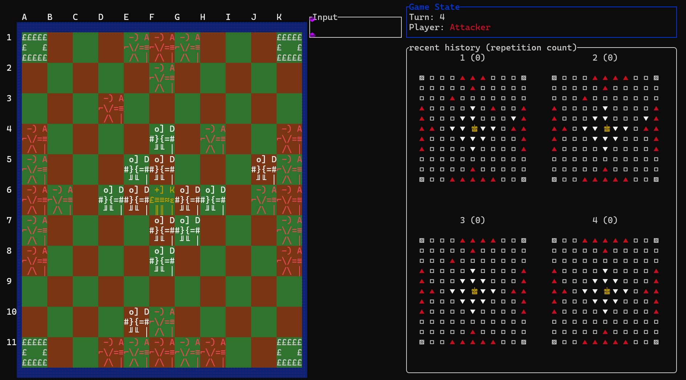

# Project Fenrir &#x130E7;
This project aims to train super-human level AI for [**Tafl**](https://en.wikipedia.org/wiki/Tafl_games), an ancient Nordic strategy boardgame family. It uses 100% pure Rust, because Rust is cool.

# 👷 NOTE 🏗️
This project is actively under development

# Project overview
The Cargo workspace consists of 3 crates: **bitboard**, **game**, and most importantly, **Fenrir**.
The **bitboard** crate provides the foundation of everything: It defines the bitfield representation of the game board for efficient game implementation.
The **game** crate implements the game logic, and with 
```
cd game
Cargo run
```
, you can play the game on your terminal (This application was developed using [_ratatui.rs_](https://ratatui.rs/))! 
<p align="center">
  
</p>

## Tafl Variants
Tafl is known for its many variations. Fenrir ___will be___ trained on two kinds: One is a very simple 7 × 7 [Brandub](http://tafl.cyningstan.com/page/171/brandub) variant, with a bare-minimum set of rules, with the addition of max move count. On the contrast, [Hnefatafl](http://www.gamecabinet.com/history/Hnef.html) is played on 11 × 11 board, with the addition of *3rd repetition rule* and *shield wall capture*. These two were selected so that the first one can serve as the proof of concept. 

## other notable points
- use of [_tch.rs_](https://github.com/LaurentMazare/tch-rs), a Rustic thin wrapper over [_libtorch_](https://docs.pytorch.org/cppdocs/), a C++ API of Pytorch.
- Faithful implementation of AlphaGO, AlphaZero paper.
- Tafl games are **Asymmetrical**, with two players playing Attacker and Defender. This creates an unavoidable imbalance to the game. This project tries to test the applicability of **Curriculum-based Reinforcement Learning** based on self-play.
- Use of [MPI](https://github.com/rsmpi/rsmpi) to scale the training over multiple node, espcially aimed at the HPC cluster at [**here in Berlin**](https://www.tu.berlin/en/math)


